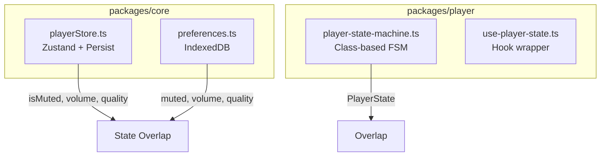

# Phân tích Code Trùng lặp và Cấu trúc VortexStream

## Tổng quan Phát hiện

Qua việc quét toàn bộ `packages/*/src`, tôi đã phát hiện **6 loại trùng lặp chính** và **3 vấn đề cấu trúc** cần được khắc phục.---

## 1. Utility Functions Trùng lặp

### 1.1 `formatCount()` - Trùng lặp NGHIÊM TRỌNG (6 lần)

| File | Vấn đề ||------|--------|| [`packages/core/src/utils/format.ts`](packages/core/src/utils/format.ts) | **Định nghĩa chính** (export) || [`packages/ui/src/components/ActionBar.tsx`](packages/ui/src/components/ActionBar.tsx) | Định nghĩa lại inline || [`packages/ui/src/components/interactions/LikeButton.tsx`](packages/ui/src/components/interactions/LikeButton.tsx) | Định nghĩa lại inline || [`packages/ui/src/components/share/ShareButton.tsx`](packages/ui/src/components/share/ShareButton.tsx) | Định nghĩa lại inline || [`packages/ui/src/components/comments/CommentSheet.tsx`](packages/ui/src/components/comments/CommentSheet.tsx) | Định nghĩa lại inline || [`packages/feed/src/components/VideoFeedItem.tsx`](packages/feed/src/components/VideoFeedItem.tsx) | Định nghĩa lại inline |**Giải pháp:** Xóa tất cả inline `formatCount()` và import từ `@vortex/core`.

### 1.2 `cn()` - Class Names Utility

| File | Vấn đề ||------|--------|| [`packages/player/src/utils/cn.ts`](packages/player/src/utils/cn.ts) | Định nghĩa đơn giản |**Giải pháp:** Nên chuyển vào `@vortex/core/utils` và reuse.---

## 2. Design Tokens Trùng lặp

### 2.1 Constants vs Styles Tokens - Định nghĩa song song

```javascript
packages/core/src/constants/   vs   packages/core/src/styles/
├── animation.ts (SPRING)      vs   └── tokens.ts (springs)
├── colors.ts (COLORS)         vs       (colors)
├── ui.ts (Z_INDEX)            vs       (zIndices)
├── ui.ts (SPACING)            vs       (spacing)
├── ui.ts (RADIUS)             vs       (radii)
└── colors.ts (SHADOWS)        vs       (shadows)
```

**Vấn đề:** Cùng một giá trị được định nghĩa ở 2 nơi với format khác nhau:

```typescript
// constants/animation.ts
export const SPRING = {
  DEFAULT: { type: 'spring', stiffness: 400, damping: 30 },
  // ...
}

// styles/tokens.ts  
export const springs = {
  default: { stiffness: 400, damping: 30 },
  // ...
}
```

**Giải pháp:** Consolidate thành 1 nguồn duy nhất trong `tokens.ts`, constants chỉ re-export.

### 2.2 Legacy Exports trong `constants/index.ts`

```typescript
// Redundant - already defined in individual files
export const ANIMATION = { ... }  // Duplicate of animation.ts
export const UI = { ... }         // Duplicate of ui.ts
export const PERFORMANCE = { ... } // Duplicate of performance.ts
```

**Giải pháp:** Xóa legacy exports, dùng named exports từ individual files.---

## 3. Components Trùng lặp

### 3.1 SeekBar - 2 phiên bản

| Package | File | Tính năng ||---------|------|-----------|| `@vortex/ui` | [`SeekBar.tsx`](packages/ui/src/components/SeekBar.tsx) | Basic seek bar || `@vortex/player` | [`controls/SeekBar.tsx`](packages/player/src/components/controls/SeekBar.tsx) | Extended với tooltip, buffered ranges array |**Giải pháp:** Merge thành 1 component trong `@vortex/ui` với props optional cho advanced features.

### 3.2 Heart Animation - 2 phiên bản

| Package | File | Hook ||---------|------|------|| `@vortex/ui` | [`DoubleTapHeart.tsx`](packages/ui/src/components/animations/DoubleTapHeart.tsx) | `useDoubleTapHeart` || `@vortex/player` | [`HeartAnimation.tsx`](packages/player/src/components/animations/HeartAnimation.tsx) | `useHeartAnimation` |**Giải pháp:** Giữ 1 phiên bản trong `@vortex/ui`, `@vortex/player` re-export.

### 3.3 PlayPause Controls - 2 phiên bản

| Package | File | Mục đích ||---------|------|----------|| `@vortex/ui` | [`PlayPauseOverlay.tsx`](packages/ui/src/components/PlayPauseOverlay.tsx) | Pure display || `@vortex/player` | [`PlayPauseButton.tsx`](packages/player/src/components/controls/PlayPauseButton.tsx) | Interactive với onClick |**Giải pháp:** Merge - `PlayPauseOverlay` với optional `onToggle` prop.---

## 4. State Management Trùng lặp

### 4.1 Player State - 3 nguồn khác nhau



**Vấn đề:**

- `playerStore` quản lý playback state + user preferences
- `preferences` storage cũng lưu muted/volume/quality  
- `player-state-machine` quản lý state riêng với own subscribers

**Giải pháp:**

- `playerStore` chỉ cho playback runtime state
- `preferences` cho persistent settings
- State machine tích hợp vào playerStore

### 4.2 Volume Management - 3 cách

| Source | Location ||--------|----------|| `playerStore` | `@vortex/core` - `isMuted`, `volume`, `setVolume` || `useVolume` | `@vortex/player` - Creates local state, syncs with store || `useVolumePreference` | `@vortex/core` - Uses IndexedDB preferences |**Giải pháp:** `useVolume` hook làm single source, internal use playerStore.---

## 5. Hooks Trùng lặp

### 5.1 Double Tap Detection - 2 hooks

| Package | File | Tính năng ||---------|------|-----------|| `@vortex/gestures` | [`useDoubleTap.ts`](packages/gestures/src/hooks/useDoubleTap.ts) | Simple double tap || `@vortex/gestures` | [`useTapGestures.ts`](packages/gestures/src/hooks/useTapGestures.ts) | Double tap + zones |**Giải pháp:** Merge - `useDoubleTap` deprecated, dùng `useTapGestures`.

### 5.2 Long Press / Hold - 2 hooks tương tự

| File | Mục đích ||------|----------|| [`useLongPress.ts`](packages/gestures/src/hooks/useLongPress.ts) | Long press với position || [`useHold.ts`](packages/gestures/src/hooks/useHold.ts) | Hold với progress callback |**Giải pháp:** Merge thành 1 hook với đầy đủ options.

### 5.3 Video Visibility/Activation Overlap

[`useVideoVisibility.ts`](packages/feed/src/hooks/useVideoVisibility.ts) và [`useVideoActivation.ts`](packages/feed/src/hooks/useVideoActivation.ts) có logic visibility tracking gần giống nhau.**Giải pháp:** `useVideoActivation` nên composition `useVideoVisibility` (đã làm) - OK nhưng cần review dependencies.---

## 6. Types có thể hợp nhất

### 6.1 Response Types Tương tự

```typescript
// types/feed.ts
interface FeedResponse {
  videos: Video[]
  nextCursor?: string
  nextPage?: number  // Extra field
  hasMore: boolean
}

// types/config.ts
interface VideoListResponse {
  videos: Video[]
  nextCursor?: string
  hasMore: boolean
  total?: number     // Extra field
}
```

**Giải pháp:** Dùng 1 type `VideoListResponse` với optional fields.---

## Kế hoạch Refactor

### Phase 1: Quick Wins (Low risk)

1. Xóa inline `formatCount()` trong 5 files - import từ core
2. Xóa legacy exports trong `constants/index.ts`
3. Move `cn()` utility vào `@vortex/core`

### Phase 2: Component Consolidation  

4. Merge SeekBar components
5. Merge Heart Animation components
6. Merge PlayPause components

### Phase 3: Hooks Cleanup

7. Deprecate `useDoubleTap`, document migration to `useTapGestures`
8. Merge `useLongPress` + `useHold`

### Phase 4: State Architecture

9. Consolidate player state management
10. Single source of truth for user preferences

### Phase 5: Design System Cleanup

11. Unify constants vs tokens
12. Consolidate response types

---

## Impact Assessment

| Thay đổi | Risk | Effort | Impact ||----------|------|--------|--------|| formatCount cleanup | Low | 30min | High - Consistency || Legacy exports removal | Low | 15min | Medium - Bundle size || Component merges | Medium | 2-3h | High - Maintainability |